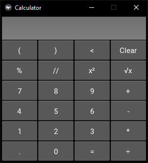
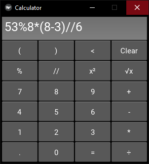

# Kyvi-calculator

Calculator written in Python. The user interface is written using the Kyvi library.

In addition to standard arithmetic, the following tools are implemented: root of a number, square of a number, division without remainder, remainder of division.

 
 

# Download & Setup Instructions :
* Clone the project. This will download the GitHub respository files onto your local machine.</br>
```Shell
git clone https://github.com/teredet/Kyvi-calculator
```
* Create a virtual environment and activate
```Shell
    pip install virtualenv
    python -m virtualenv envname
    envname\scripts\activate
```
* Install requirements
```Shell
    cd Kyvi-calculator
    pip install -r requirements.txt
```
* Run program
```Shell
    python calculator.py
```

# Features
* Basic arithmetic ( - , + , * , / )
* Additional tools ( х² , √x , // , % )
# Tech Stack
* Python
* Kivy
